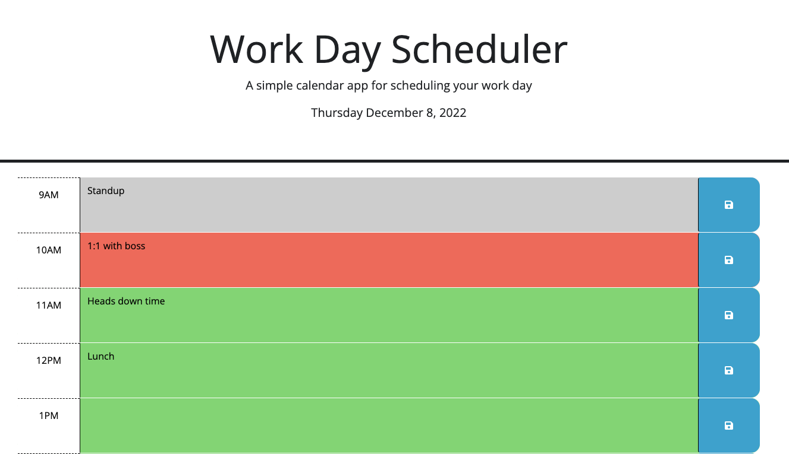

# Workday Scheduler

## Description

A simple calendar application that allows a user to save events for each hour of the business day (9am-5pm). 

Days in the past will be faded in gray, the current hour is highlighted in red, and the future is bright and green.

## Usage

1. Navigate to the website on [Github Pages](https://exzilium.github.io/workday-scheduler/)
2. Enter any events you'd like in each hour block.
3. Click the Save icon on each block to save that event.
4. When the page is refreshed, the event will persist in that time block when you return.

## Credits

- MDN web docs for [JavaScript](https://developer.mozilla.org/en-US/docs/Web/JavaScript)
- W3Schools jQuery [Tutorials](https://www.w3schools.com/jquery/)
- Day.js [Documentation](https://day.js.org/en/)

## License

N/A
